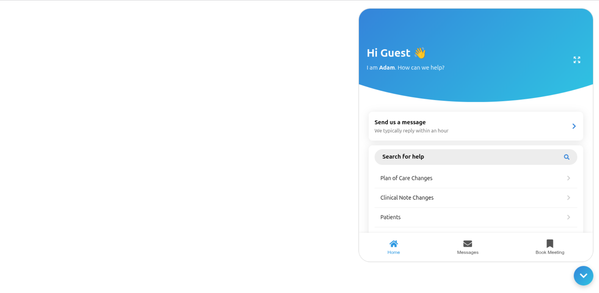

# SAAS Chatbot



## 🚀 Overview

SAAS Chatbot is a sleek, AI-powered frontend chatbot built with React and TypeScript, designed to integrate seamlessly with an **n8n** backend workflow for AI response automation. It uses OpenAI via n8n to deliver intelligent, real-time conversations on your website — no traditional backend needed!

## 🧠 Features

- Modern, responsive chat UI built with React and Bootstrap
- Easy integration with n8n workflows handling message processing
- User onboarding with name & email capture
- Persistent chat history stored in browser sessionStorage
- Extendable UI with customizable options like chat window resizing
- Simple deployment and maintenance by leveraging n8n's no-code backend

## 🛠️ Technologies Used

- **Frontend:** React.js, TypeScript, Bootstrap, Framer Motion
- **Backend:** n8n workflows (no custom server code)
- **AI Integration:** OpenAI API via n8n HTTP Request nodes
- **State Management:** React Hooks & sessionStorage for persistence

## 📦 Installation & Setup

### Clone the repository

```bash
git clone https://github.com/alihassanml/SAAS-Chatbot.git
cd SAAS-Chatbot
````

### Install dependencies

```bash
npm install
```

### Configure Environment Variables

Set your OpenAI API key and n8n webhook URL inside your n8n instance and update the frontend to point to your n8n webhook URL for chat requests.

### Start development server

```bash
npm start
```

Open your browser at `http://localhost:3000` to test the chatbot.

## 🔗 Backend (n8n) Setup

* Configure an n8n workflow with an HTTP Webhook node to receive chat messages.
* Use OpenAI API nodes or HTTP Request nodes within n8n to generate AI responses.
* Respond back to the frontend with the chatbot's replies.

## 📸 Screenshots


## 🌐 Live Demo

\[Your live demo link here]

## 📝 License

MIT License - see [LICENSE](https://github.com/alihassanml/SAAS-Chatbot/blob/main/LICENSE)

## 🤝 Contributing

Feel free to fork and submit PRs. Open issues for feature requests or bug reports.

## 📬 Contact

Reach me at [alihassanbscs99@gmail.com](mailto:alihassanbscs99@gmail.com)